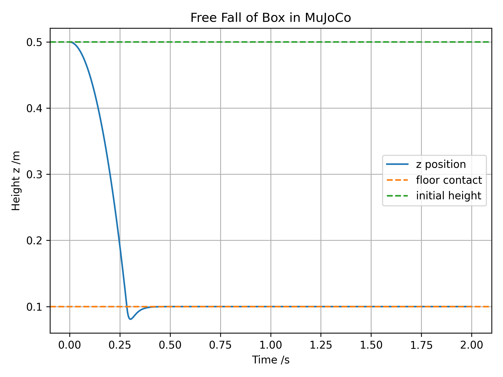
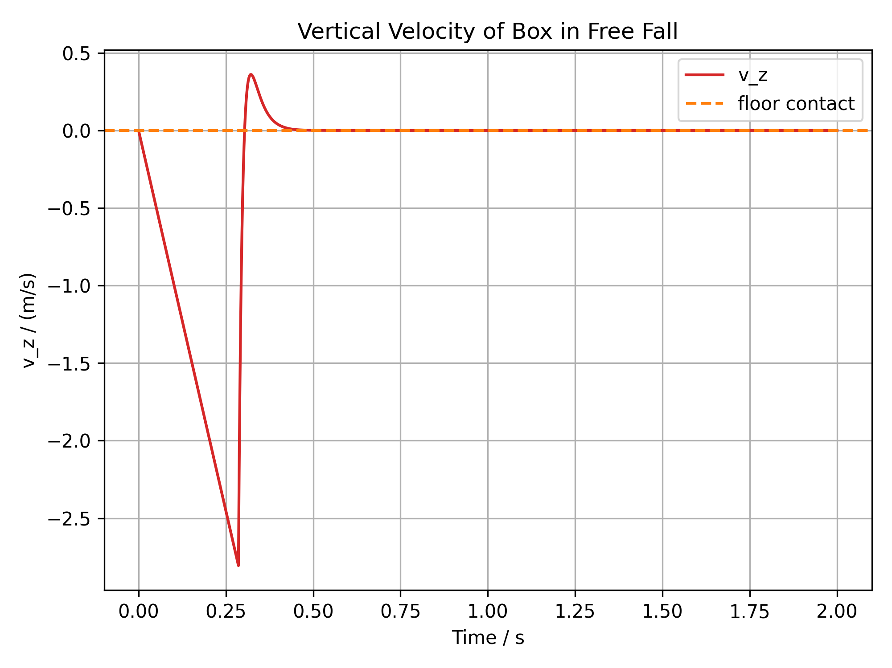
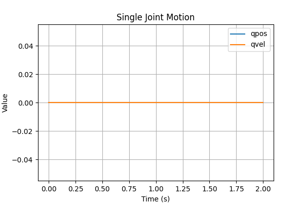
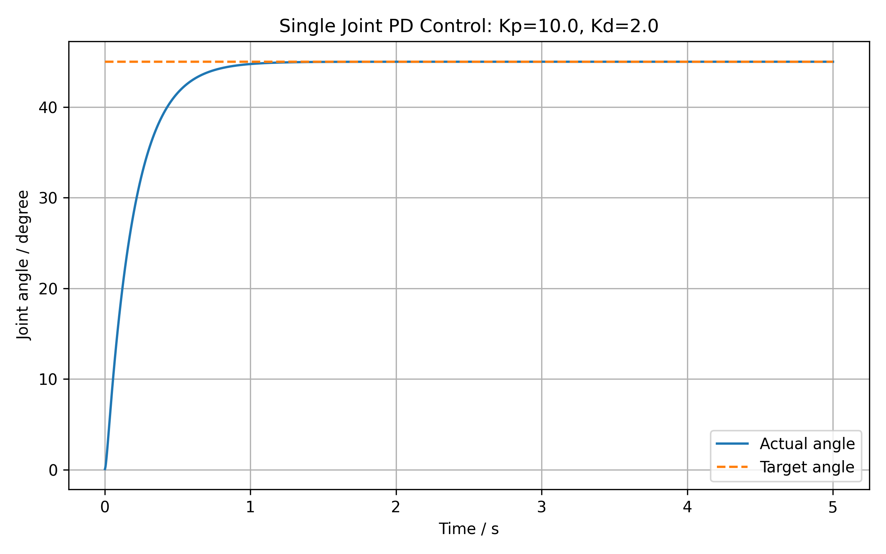
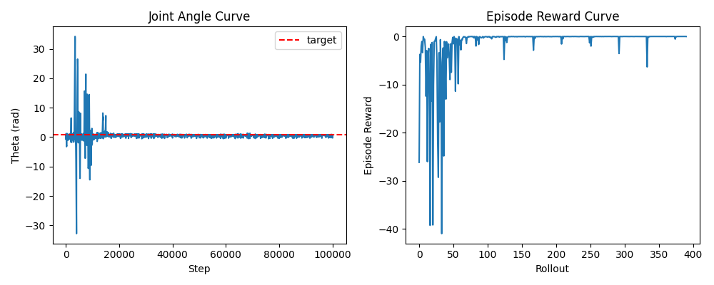
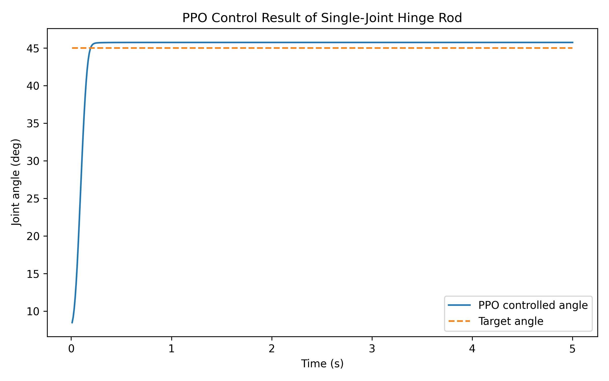
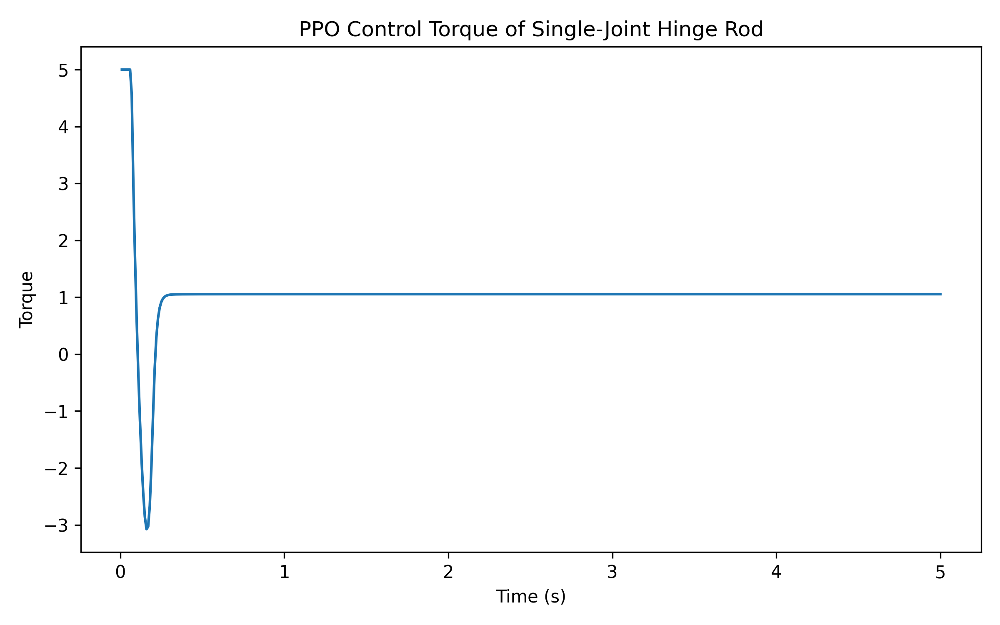
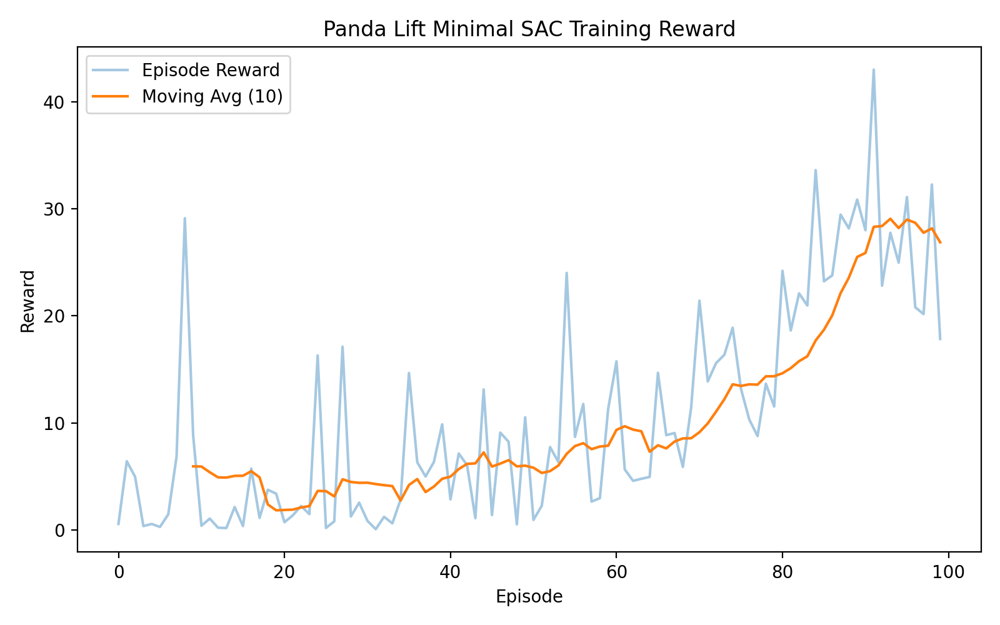

# MuJoCo RL Project

## 项目简介

本项目是一个面向机器人学习、强化学习控制与具身智能方向的 MuJoCo / robosuite / Stable-Baselines3 实验项目。

项目从最基础的 MuJoCo 模型加载和自由落体仿真开始，逐步扩展到单关节控制、PPO 强化学习训练闭环，并进一步接入 robosuite Panda Lift 机械臂操作任务，完成随机策略、手工策略和最小 SAC 训练流程。

本项目的重点不是声称已经获得高成功率的机械臂抓取策略，而是展示一个完整、可复现、可解释的机器人强化学习项目搭建过程，包括环境验证、模型理解、控制实验、任务分析、训练流程、结果记录和真实边界表达。

---

## Project Highlights

- 搭建 MuJoCo + Python 仿真环境，并完成基础模型加载、状态读取和可视化分析；
- 编写 MJCF 模型，理解 `MjModel`、`MjData`、`qpos`、`qvel`、`ctrl` 等核心数据结构；
- 完成自由落体仿真实验，记录位置和速度曲线；
- 搭建单关节可控模型，实现 PD 控制并分析不同参数对系统响应的影响；
- 将单关节 MuJoCo 模型封装为 Gymnasium 环境，并使用 PPO 完成强化学习训练闭环；
- 接入 robosuite Panda Lift 任务，分析 observation、action、reward、success 和 reset 机制；
- 实现 Panda Lift 随机策略 baseline 和手工策略，用于验证任务接口与控制逻辑；
- 搭建 Panda Lift 最小 SAC 训练流程，完成模型保存、reward 曲线记录和评估脚本；
- 整理实验记录、结果图、演示视频和项目边界，形成可用于简历展示的 GitHub 作品集。

---

## Tech Stack

- Python 3.10
- MuJoCo
- robosuite
- Gymnasium
- Stable-Baselines3
- NumPy
- Matplotlib
- Linux / Ubuntu
- Git / GitHub

---

## Project Structure

```text
mujoco_rl_project/
├── README.md
├── requirements.txt
├── assets/
│   ├── week01_box_free_fall_position.png
│   ├── week01_box_free_fall_velocity.png
│   ├── week02_joint_motion.png
│   ├── week02_ppo_hinge_rod_angle_curve.png
│   ├── week02_ppo_hinge_rod_torque_curve.png
│   ├── week02_single_joint_pd_Kp10_Kd2.png
│   ├── week02_single_joint_pd_Kp20_Kd2.png
│   ├── week02_single_joint_pd_Kp20_Kd6.png
│   ├── week02_single_joint_pd_Kp5_Kd2.png
│   ├── week03_panda_lift_random_demo.mp4
│   └── week03_panda_lift_handcrafted_ep0.mp4
├── models/
│   ├── simple_box.xml
│   ├── mjcf_structure_demo.xml
│   ├── hinge_rod.xml
│   ├── ppo_hinge_rod/
│   │   ├── final_model.zip
│   │   └── training_curves.png
│   └── sac_panda_lift_minimal/
│       ├── final_model.zip
│       └── reward_curve.png
├── notes/
│   ├── week01_day04_mjmodel_mjdata.md
│   ├── week01_day05_simulation_analysis.md
│   ├── week01_review.md
│   ├── week02_day01_mjcf.md
│   ├── week02_pd_demo.md
│   ├── week02_ppo_rl_demo.md
│   ├── week03_panda_lift_intro.md
│   ├── week03_panda_lift_baseline_analysis.md
│   ├── week03_panda_lift_handcrafted_policy.md
│   └── week03_panda_lift_minimal_rl.md
├── src/
│   ├── check_mujoco.py
│   ├── inspect_model.py
│   ├── parse_mjcf.py
│   ├── run_simple_box.py
│   ├── simulate_box.py
│   ├── simulate_box_plot.py
│   ├── read_joint.py
│   ├── run_single_joint_pd.py
│   ├── hinge_rod_env.py
│   ├── test_hinge_rod_env.py
│   ├── train_ppo_hinge_rod_full.py
│   ├── eval_ppo_hinge_rod.py
│   ├── plot_ppo_hinge_rod_eval.py
│   ├── test_robosuite_lift.py
│   ├── test_panda_action_dimensions.py
│   ├── test_panda_gripper.py
│   ├── test_panda_reset.py
│   ├── analyze_panda_lift_task.py
│   ├── run_panda_lift_random_baseline.py
│   ├── run_panda_lift_handcrafted_policy.py
│   ├── panda_lift_rl_env.py
│   ├── test_panda_lift_rl_env.py
│   ├── train_panda_lift_sac.py
│   └── evaluate_panda_lift_sac.py
└── results/
    └── README.md
```

---

## 1. MuJoCo 基础仿真：自由落体实验

第一阶段完成 MuJoCo 环境验证、MJCF 模型加载、仿真状态读取和自由落体结果可视化。

核心文件：

```bash
models/simple_box.xml
src/check_mujoco.py
src/run_simple_box.py
src/simulate_box_plot.py
src/inspect_model.py
```

该阶段主要理解：

- MuJoCo XML 模型如何定义物体、地面、重力和自由关节；
- `MjModel` 表示仿真模型结构；
- `MjData` 表示仿真运行过程中的状态；
- `qpos`、`qvel` 如何记录位置和速度；
- `mj_step()` 如何推进仿真。

自由落体实验中，box 从约 0.5 m 高度下落，与地面接触后稳定在约 0.1 m 高度附近，与 box 半高一致。

### Results





---

## 2. 单关节控制：PD 控制实验

第二阶段从自由物体仿真转向可控关节模型，搭建了一个单关节旋转杆 `hinge_rod.xml`。

核心文件：

```bash
models/hinge_rod.xml
src/read_joint.py
src/run_single_joint_pd.py
notes/week02_pd_demo.md
```

该阶段主要理解：

- `<joint>` 如何定义可运动自由度；
- `<actuator>` 如何将控制输入作用到关节；
- `data.ctrl[i]` 如何作为控制量输入；
- PD 控制中 `Kp` 和 `Kd` 对响应速度、超调和稳定性的影响。

控制形式：

```text
torque = Kp * (target_angle - current_angle) - Kd * current_angular_velocity
```

实验中测试了多组参数，包括：

- `Kp=5, Kd=2`
- `Kp=10, Kd=2`
- `Kp=20, Kd=2`
- `Kp=20, Kd=6`

### Results





---

## 3. 单关节强化学习：PPO 训练闭环

在完成 PD 控制后，本项目将单关节 MuJoCo 模型封装为 Gymnasium 环境，并使用 Stable-Baselines3 PPO 训练策略控制旋转杆到达目标角度。

核心文件：

```bash
src/hinge_rod_env.py
src/test_hinge_rod_env.py
src/train_ppo_hinge_rod_full.py
src/eval_ppo_hinge_rod.py
src/plot_ppo_hinge_rod_eval.py
models/ppo_hinge_rod/final_model.zip
models/ppo_hinge_rod/training_curves.png
notes/week02_ppo_rl_demo.md
```

该阶段完成了从自建 MuJoCo 模型到强化学习训练的完整闭环：

- 自定义 Gymnasium 环境；
- 定义 observation space 和 action space；
- 设计 reward；
- 使用 PPO 训练策略；
- 保存模型；
- 评估训练结果；
- 绘制角度曲线和 torque 曲线。

阶段性结果显示，PPO 策略能够将单关节旋转杆控制到目标角度附近，说明 MuJoCo + Gymnasium + Stable-Baselines3 的训练流程已经跑通。

### Results







---

## 4. Panda Lift 机械臂操作任务分析

第三阶段接入 robosuite Panda Lift 任务，从单关节控制扩展到标准机械臂操作任务。

核心文件：

```bash
src/test_robosuite_lift.py
src/test_panda_action_dimensions.py
src/test_panda_gripper.py
src/test_panda_reset.py
src/analyze_panda_lift_task.py
notes/week03_panda_lift_intro.md
```

该阶段主要分析：

- Panda 七自由度机械臂和两指夹爪；
- observation 中的关节状态、末端位姿、夹爪状态、方块位置和相对位置；
- 7 维连续 action 对末端运动和夹爪开合的控制作用；
- reward、done、success 和 reset 随机化机制；
- 为什么随机策略难以完成抓取任务。

关键 observation 包括：

```text
robot0_eef_pos
robot0_eef_quat
robot0_gripper_qpos
cube_pos
cube_quat
gripper_to_cube_pos
object-state
```

---

## 5. Panda Lift Baseline：随机策略

为了建立任务基线，本项目首先运行随机策略 baseline。

核心文件：

```bash
src/run_panda_lift_random_baseline.py
assets/week03_panda_lift_random_demo.mp4
notes/week03_panda_lift_baseline_analysis.md
```

实验结果：

```text
Random baseline average reward: 3.75
Random baseline success rate: 0.0
```

随机策略无法完成稳定抓取和抬升，说明 Panda Lift 任务需要利用 observation 进行有目标的控制策略设计。

### Demo

演示视频：

```text
assets/week03_panda_lift_random_demo.mp4
```

---

## 6. Panda Lift Handcrafted Policy：手工策略验证

在训练强化学习策略之前，本项目实现了一个分阶段手工策略，用于验证 Panda Lift 任务是否可以通过合理动作序列完成接近、抓取和抬升流程。

核心文件：

```bash
src/run_panda_lift_handcrafted_policy.py
assets/week03_panda_lift_handcrafted_ep0.mp4
notes/week03_panda_lift_handcrafted_policy.md
```

手工策略大致分为：

1. 移动到方块上方；
2. 下降到抓取高度；
3. 闭合夹爪；
4. 抬升方块；
5. 根据 success 判断任务是否完成。

该部分的意义在于：

- 验证 observation 读取是否正确；
- 验证 action 控制方向是否正确；
- 验证 gripper 开合符号是否正确；
- 验证 reward 和 success 机制是否正常；
- 为后续强化学习训练提供任务理解基础。

### Demo

演示视频：

```text
assets/week03_panda_lift_handcrafted_ep0.mp4
```

---

## 7. Panda Lift 最小 SAC 训练流程

在完成任务分析和手工策略验证后，本项目搭建了 Panda Lift 的最小 SAC 强化学习训练流程。

核心文件：

```bash
src/panda_lift_rl_env.py
src/test_panda_lift_rl_env.py
src/train_panda_lift_sac.py
src/evaluate_panda_lift_sac.py
models/sac_panda_lift_minimal/final_model.zip
models/sac_panda_lift_minimal/reward_curve.png
notes/week03_panda_lift_minimal_rl.md
```

该阶段主要完成：

- 将 robosuite Panda Lift 环境封装为 Stable-Baselines3 可训练接口；
- 对 observation 进行 flatten 处理；
- 适配连续 action space；
- 使用 SAC 进行最小训练实验；
- 保存训练模型；
- 记录 episode reward；
- 绘制 reward 曲线；
- 编写评估脚本检查训练结果。

### Results



---

## Current Results and Honest Limitations

### Completed

目前项目已经完成：

- MuJoCo 基础仿真环境搭建；
- MJCF 模型结构与状态字段理解；
- 自由落体仿真和曲线记录；
- 单关节 PD 控制实验；
- 单关节 PPO 强化学习训练闭环；
- robosuite Panda Lift 环境接入；
- Panda Lift observation / action / reward / success 分析；
- Panda Lift 随机策略 baseline；
- Panda Lift 手工策略验证；
- Panda Lift 最小 SAC 训练流程；
- 模型保存、reward 曲线和实验记录整理。

### Honest Limitations

当前项目仍处于机器人强化学习入门与流程验证阶段，存在以下边界：

- Panda Lift SAC 训练时间较短，尚未获得稳定高成功率策略；
- 当前 SAC 实验主要用于验证训练闭环，不代表已经解决机械臂抓取任务；
- PPO / SAC 超参数尚未进行系统性调参；
- Panda Lift reward shaping、controller 配置和 observation 设计仍有优化空间；
- 项目目前全部在仿真环境中完成，尚未迁移到真实机械臂；
- 手工策略主要用于接口验证和任务理解，不是最终学习策略。

该项目的真实价值在于展示机器人学习项目从 0 到 1 的搭建能力，包括环境配置、任务理解、控制实验、强化学习训练接口封装、结果记录和问题边界分析。

---

## How to Run

### 1. Install Dependencies

建议使用 conda 环境：

```bash
conda create -n mujoco_rl python=3.10
conda activate mujoco_rl
pip install -r requirements.txt
```

### 2. Check MuJoCo Environment

```bash
python src/check_mujoco.py
```

### 3. Run Free Fall Simulation

```bash
python src/run_simple_box.py
python src/simulate_box_plot.py
```

### 4. Run Single Joint PD Control

```bash
python src/read_joint.py
python src/run_single_joint_pd.py
```

### 5. Train PPO on Hinge Rod

```bash
python src/test_hinge_rod_env.py
python src/train_ppo_hinge_rod_full.py
python src/eval_ppo_hinge_rod.py
python src/plot_ppo_hinge_rod_eval.py
```

### 6. Test Panda Lift Environment

```bash
python src/test_robosuite_lift.py
python src/test_panda_action_dimensions.py
python src/test_panda_gripper.py
python src/test_panda_reset.py
python src/analyze_panda_lift_task.py
```

### 7. Run Panda Lift Baselines

```bash
python src/run_panda_lift_random_baseline.py
python src/run_panda_lift_handcrafted_policy.py
```

### 8. Train and Evaluate Panda Lift SAC

```bash
python src/test_panda_lift_rl_env.py
python src/train_panda_lift_sac.py
python src/evaluate_panda_lift_sac.py
```

---

## Future Work

后续计划包括：

- 系统调节 Panda Lift SAC / PPO 超参数；
- 增加 success rate 曲线和多随机种子实验；
- 优化 reward shaping；
- 调整 robosuite controller 配置；
- 引入 imitation learning / behavior cloning baseline；
- 尝试更复杂的 robosuite 操作任务，例如 PickPlace、Stack、NutAssembly；
- 探索 sim-to-real 和真实机器人操作任务迁移。

---

## Project Positioning

本项目是个人面向机器人学习、强化学习控制和具身智能方向的阶段性实践项目。

项目重点展示：

- MuJoCo / robosuite 仿真环境搭建能力；
- 机器人状态、动作、奖励和成功判据分析能力；
- Python 强化学习实验代码组织能力；
- Stable-Baselines3 训练流程使用能力；
- 实验结果记录、可视化和真实边界表达能力。

该项目会作为后续学习机器人操作、模仿学习、强化学习控制和具身智能算法的基础。
