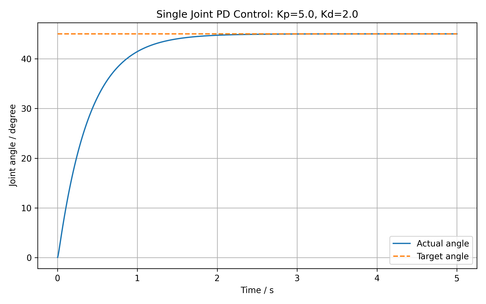
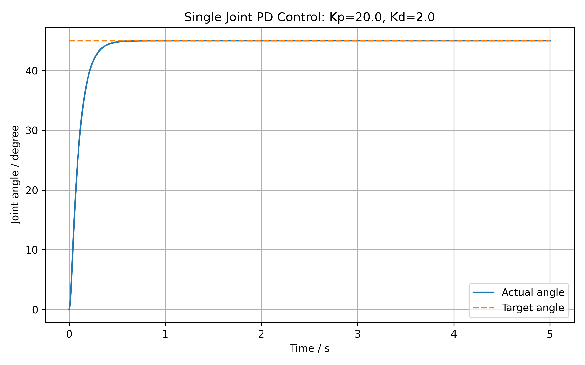
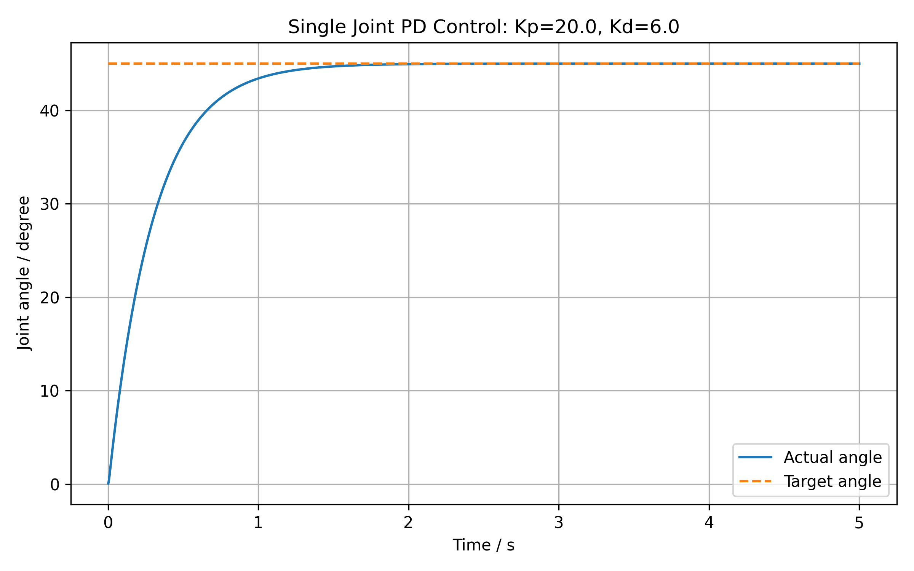

# Week 2：单关节 PD 控制初版实验记录

## 1. 实验目标

本实验基于 MuJoCo 搭建单关节旋转杆模型，通过执行器向 `hinge` 关节施加控制力矩，实现固定目标角度下的 PD 闭环控制，并观察不同控制参数对角度跟踪过程的影响。

本次实验的主要目标包括：

* 确认 `hinge` 关节与 `motor` actuator 的控制关系；
* 读取关节位置 `qpos` 和关节速度 `qvel`；
* 通过 `data.ctrl` 写入控制输入；
* 实现目标角度为 `45°` 的单关节 PD 控制；
* 保存实际角度跟踪曲线；
* 对比不同 `Kp`、`Kd` 参数下的响应特征；
* 分析模型几何与地面接触对控制结果的影响。

---

## 2. 模型结构

### 2.1 模型文件

* 模型文件：`models/hinge_rod.xml`
* 控制脚本：`src/run_single_joint_pd.py`

### 2.2 受控对象

模型中设置了一个绕固定轴旋转的单自由度关节：

* body：`hinge_rod`
* joint：`rod_hinge`
* joint 类型：`hinge`
* actuator 类型：`motor`
* 控制范围：`ctrlrange="-5 5"`

模型中的执行器绑定到 `rod_hinge` 关节，因此 Python 脚本可通过 `data.ctrl[0]` 向该关节施加控制输入。

在当前单关节模型中，仿真状态维度为：

```text
nq = 1
nv = 1
nu = 1
```

其中：

* `data.qpos[0]` 表示旋转关节的当前角位置；
* `data.qvel[0]` 表示旋转关节的当前角速度；
* `data.ctrl[0]` 表示电机执行器接收的控制输入。

---

## 3. PD 控制方法

本实验采用固定目标角度下的 PD 闭环控制。控制律为：

[
\tau = K_p(q_{\mathrm{target}} - q) - K_d \dot{q}
]

式中：

* (\tau) 为施加到关节上的控制力矩；
* (K_p) 为比例增益；
* (K_d) 为微分增益；
* (q_{\mathrm{target}}) 为目标角度；
* (q) 为当前关节角度；
* (\dot{q}) 为当前关节角速度。

本实验设置目标角度为：

[
q_{\mathrm{target}} = 45^\circ
]

为避免控制输入过大，脚本中对控制力矩进行了限幅处理：

```python
torque = np.clip(torque, -torque_limit, torque_limit)
```

其中：

```python
torque_limit = 5.0
```

仿真循环采用以下执行顺序：

1. 读取当前关节位置和角速度；
2. 计算当前位置误差；
3. 根据 PD 控制律计算控制力矩；
4. 对控制力矩进行限幅；
5. 将控制量写入 `data.ctrl`；
6. 调用 `mujoco.mj_step()` 推进仿真；
7. 记录时间、实际角度、目标角度和控制量，用于结果绘图与分析。

---

## 4. 模型问题定位与修正

在初始实验中，虽然 PD 控制脚本可以正常运行，但实际角度最终稳定在约 `60°` 附近，未能跟踪目标角度 `45°`。

通过观察曲线和检查模型结构发现，问题并非来源于 PD 控制公式，而是由于旋转杆的初始安装位置过低，杆体与地面发生了碰撞。原模型中，旋转杆在初始状态或旋转至目标姿态附近时会与地面发生几何干涉，地面接触约束阻止了关节继续按照控制目标运动。

该现象说明：

* 控制结果异常时，不能只检查控制器参数；
* 还必须检查模型几何尺寸、初始位置、关节安装关系以及碰撞接触状态；
* 若目标姿态本身受到环境约束，即使控制器正确，也无法实现预期跟踪效果。

为消除地面碰撞对控制实验的影响，本实验提高了旋转杆在模型中的安装高度，使其在整个角度跟踪过程中不再与地面发生接触。修正模型后，单关节能够稳定跟踪 `45°` 目标角度，曲线表现恢复正常。

---

## 5. 参数实验设置

在修正模型碰撞问题后，保持以下实验条件一致：

* 目标角度：`45°`
* 仿真时间：`5.0 s`
* 力矩限幅：`[-5, 5]`
* 模型文件：`models/hinge_rod.xml`

分别测试以下四组 PD 参数：

| 组别 | (K_p) | (K_d) | 实验目的                   |
| -- | ----: | ----: | ---------------------- |
| A  |   5.0 |   2.0 | 观察较小比例增益下的响应过程         |
| B  |  10.0 |   2.0 | 观察提高比例增益后的响应变化         |
| C  |  20.0 |   2.0 | 观察较高比例增益下的快速跟踪效果       |
| D  |  20.0 |   6.0 | 在相同 (K_p) 下观察增大微分增益的影响 |

---

## 6. 实验结果

### 6.1 参数组 A：(K_p=5.0,\ K_d=2.0)

实验结果图如下：



该组参数下，实际角度能够平滑接近目标角度，且未出现明显过冲。由于比例增益较小，位置误差对应的控制作用相对较弱，因此关节接近目标角度的速度较慢。

该组实验说明：较小的 (K_p) 能够获得较平稳的响应，但会牺牲跟踪速度。

---

### 6.2 参数组 B：(K_p=10.0,\ K_d=2.0)

实验结果图如下：


与参数组 A 相比，该组将 (K_p) 从 `5.0` 提高至 `10.0`，而 (K_d) 保持不变。曲线显示，实际角度更快接近 `45°` 目标角度，同时仍未出现明显过冲。

该组实验说明：在当前模型和控制范围内，适当增大 (K_p) 可以提升关节响应速度，同时保持较好的稳定性。

---

### 6.3 参数组 C：(K_p=20.0,\ K_d=2.0)

实验结果图如下：



该组参数下，实际角度在四组实验中最快接近目标角度，且曲线仍保持平滑，未观察到明显过冲或持续振荡。

该结果说明：在当前单关节模型、目标角度和力矩限幅设置下，提高 (K_p) 能够显著提升角度跟踪速度。由于 (K_d=2.0) 已能够提供一定速度抑制作用，因此当前实验范围内未表现出明显的不稳定现象。

基于当前结果，参数组 C 可作为本阶段单关节快速跟踪效果的展示参数。

---

### 6.4 参数组 D：(K_p=20.0,\ K_d=6.0)

实验结果图如下：



该组保持 (K_p=20.0) 不变，并将 (K_d) 从 `2.0` 提高至 `6.0`。曲线显示，实际角度仍能够稳定跟踪目标角度，但上升速度明显慢于参数组 C。

该结果说明：增大 (K_d) 会增强对关节运动速度的抑制作用。在当前实验中，参数组 C 本身未出现明显过冲，因此进一步提高 (K_d) 未体现出明显的过冲改善效果，反而使关节接近目标角度的过程变慢。

---

## 7. 参数对比分析

四组参数的整体表现如下：

| 参数组 | 参数设置                 | 响应速度 | 明显过冲  | 稳定跟踪情况 | 结果分析                |
| --- | -------------------- | ---- | ----- | ------ | ------------------- |
| A   | (K_p=5.0,\ K_d=2.0)  | 较慢   | 无明显过冲 | 能够稳定跟踪 | 比例作用较弱，响应平稳但偏慢      |
| B   | (K_p=10.0,\ K_d=2.0) | 中等   | 无明显过冲 | 能够稳定跟踪 | 提高比例增益后，响应速度提升      |
| C   | (K_p=20.0,\ K_d=2.0) | 最快   | 无明显过冲 | 能够稳定跟踪 | 当前实验中快速性最好，适合作为展示参数 |
| D   | (K_p=20.0,\ K_d=6.0) | 较慢   | 无明显过冲 | 能够稳定跟踪 | 微分作用增强，运动过程受到更强抑制   |

从参数对比结果可以得到以下结论：

1. 在 (K_d=2.0) 保持不变时，将 (K_p) 从 `5.0` 提高至 `20.0`，实际角度接近目标角度的速度明显加快；
2. 在 (K_p=20.0) 保持不变时，将 (K_d) 从 `2.0` 提高至 `6.0`，关节响应速度明显下降；
3. 当前四组参数均未出现明显持续振荡，说明模型修正后 PD 控制闭环能够正常工作；
4. 当前实验并不能直接证明“增大 (K_d) 能够减小过冲”，因为低阻尼参数组本身没有表现出明显过冲；
5. 本实验中，(K_p=20.0,\ K_d=2.0) 在快速性和平稳性之间表现较好，可作为阶段性 demo 的展示参数。

---

## 8. 本阶段完成内容

本阶段完成了以下工作：

* 建立带有 `hinge` 关节与 `motor` actuator 的单关节 MuJoCo 模型；
* 理解并读取关节状态 `qpos` 与 `qvel`；
* 通过 `data.ctrl` 实现电机控制输入写入；
* 实现固定目标角度下的单关节 PD 闭环控制；
* 定位并修正杆体与地面碰撞导致的控制异常问题；
* 完成四组 (K_p)、(K_d) 参数实验；
* 保存四组实际运行得到的角度跟踪曲线；
* 根据真实曲线完成参数影响分析。

---

## 9. 本阶段总结

本实验实现了 MuJoCo 环境下的单关节 PD 角度控制闭环。通过读取关节位置和角速度、计算 PD 控制力矩并写入执行器输入，实现了旋转杆对 `45°` 目标角度的稳定跟踪。

实验过程中，初始模型由于杆体与地面发生碰撞，导致控制结果无法正确反映 PD 控制效果。通过检查模型几何关系并修正杆体安装高度，消除了环境接触对控制过程的干扰。该问题定位过程说明，在机器人仿真实验中，控制算法验证必须建立在正确的模型结构和合理的碰撞约束基础之上。

参数实验结果表明，在当前模型设置下，提高比例增益 (K_p) 能够明显提升目标角度跟踪速度；提高微分增益 (K_d) 会加强对运动速度的抑制作用，但在没有明显过冲的情况下，也可能降低整体响应速度。综合四组结果，(K_p=20.0,\ K_d=2.0) 具有较好的快速跟踪效果，可作为后续项目展示和 README 更新中的代表性实验结果。
