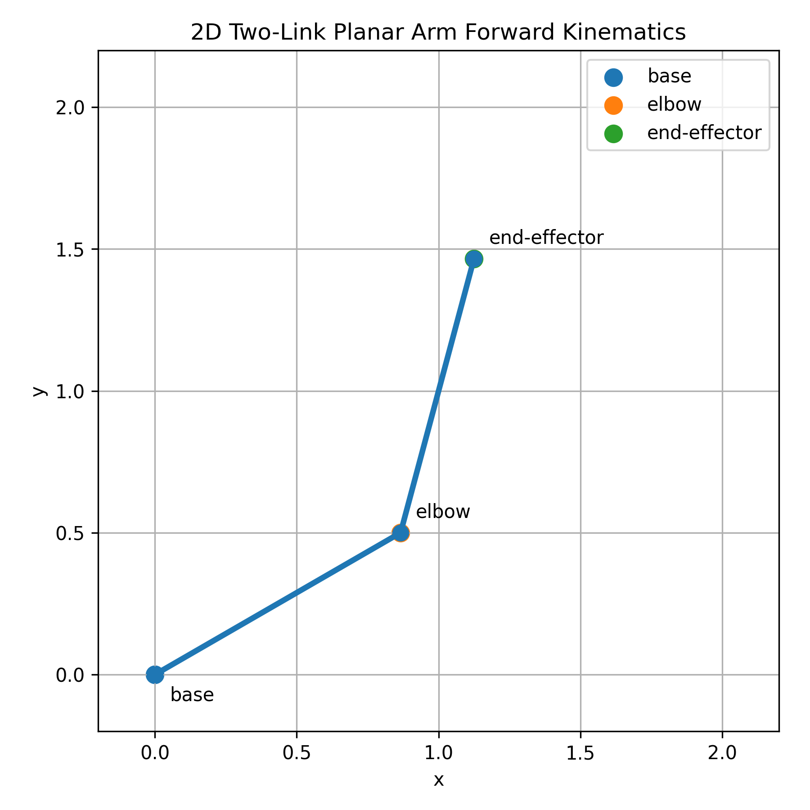
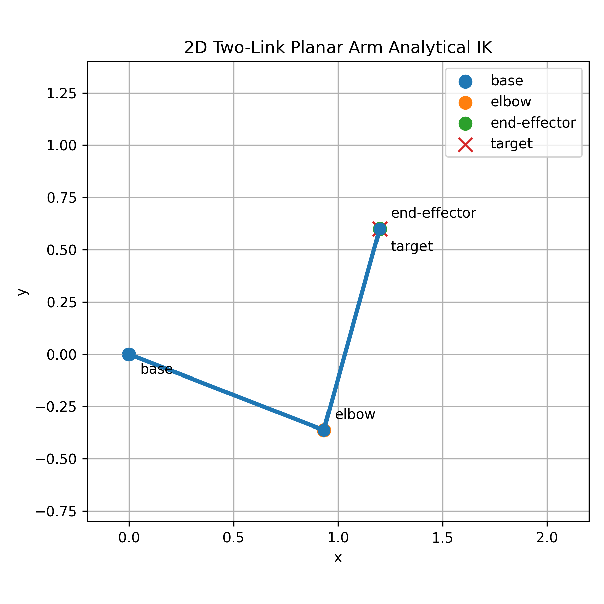
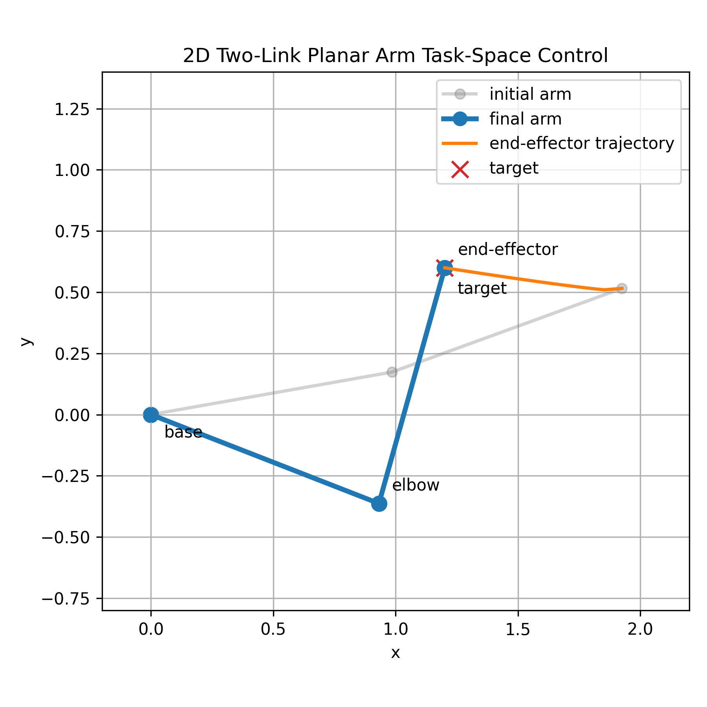

# Week 6 Task B: FK / IK / Task-Space Control Minimal Demo

## 1. 实验目标

本实验使用一个最小 2D 平面二连杆机械臂，理解关节空间、任务空间、正运动学 FK、逆运动学 IK、Jacobian，以及基于 Jacobian 的任务空间控制。

本实验重点放在运动学层面，不涉及复杂机器人动力学、接触建模或力矩控制。目标是把 Panda Lift 中“策略输出任务空间动作，底层控制器驱动关节运动”的逻辑拆成一个可视化、可验证的小例子。

核心概念：

- 关节空间：用关节角 `theta1`、`theta2` 表示机械臂姿态。
- 任务空间：用末端执行器的二维坐标 `[x, y]` 表示目标或当前位置。
- FK：由关节角计算末端执行器位置。
- IK：由目标末端位置反推关节角。
- Jacobian：描述关节速度和末端速度之间的局部线性关系。
- 任务空间控制：根据末端位置误差，计算期望末端速度，再通过 Jacobian 伪逆转换为关节速度。

---

## 2. 模块 A：FK 可视化

脚本：

```text
src/planar_arm_fk_demo.py
```

输出图片：

```text
assets/week06_planar_arm_fk.png
```



实验设置：

```text
l1 = 1.0
l2 = 1.0
theta1 = 30 deg
theta2 = 45 deg
```

FK 的含义是：已知关节角，计算机械臂末端在任务空间中的位置。

在这个二连杆机械臂中，第一段连杆方向由 `theta1` 决定，第二段连杆方向由 `theta1 + theta2` 决定。因此可以通过连杆向量相加得到 elbow 和 end-effector：

```text
elbow = base + l1 * [cos(theta1), sin(theta1)]
end_effector = elbow + l2 * [cos(theta1 + theta2), sin(theta1 + theta2)]
```

这个模块验证的是：

```text
joint angles -> end-effector position
```

也就是从关节空间到任务空间的映射。

---

## 3. 模块 B：解析 IK 验证

脚本：

```text
src/planar_arm_ik_demo.py
```

输出图片：

```text
assets/week06_planar_arm_ik.png
```



目标点：

```text
target = [1.2, 0.6]
```

解析 IK 结果：

```text
theta1 = -21.304534 deg
theta2 = 95.739170 deg
```

再用 FK 验证：

```text
FK end_effector = [1.2, 0.6]
error norm = 0
```

IK 的含义是：已知任务空间中的目标点，反推出能够到达这个目标点的关节角。

对于 2D 二连杆机械臂，可以把 `base`、`elbow`、`target` 看成一个三角形。三条边分别是：

```text
l1, l2, r
```

其中：

```text
r = sqrt(x^2 + y^2)
```

先用余弦定理求 `theta2`，再根据目标方向角和三角形内部偏转角求 `theta1`。

这个模块验证的是：

```text
target position -> joint angles -> FK verification
```

需要注意，IK 可能存在多解。对于 2D 二连杆机械臂，常见的是 elbow-up 和 elbow-down 两种构型。当前脚本默认使用其中一个解析解分支。

---

## 4. 模块 C：Jacobian 任务空间控制

脚本：

```text
src/planar_arm_task_space_control.py
```

输出图片：

```text
assets/week06_planar_arm_task_space_control.png
```



实验设置：

```text
target = [1.2, 0.6]
initial theta = [10 deg, 10 deg]
Kp = 1.0
dt = 0.05
max_steps = 200
tolerance = 1e-3
```

控制循环：

```text
x_cur = FK(q)
e = target - x_cur
x_dot_des = Kp * e
q_dot = pinv(J(q)) @ x_dot_des
q = q + q_dot * dt
```

最终结果：

```text
final theta = [-21.298212 deg, 95.678984 deg]
final end_effector = [1.2009456, 0.59985011]
final error norm = 0.000957404460
total steps = 128
```

这个模块没有直接用解析 IK 一步求出关节角，而是从初始姿态开始，通过任务空间误差逐步逼近目标点。

Jacobian 描述的是局部速度关系：

```text
x_dot = J(q) q_dot
```

为了让末端朝目标点移动，先定义期望末端速度：

```text
x_dot_des = Kp * (target - x_cur)
```

然后用 Jacobian 伪逆将任务空间速度转换为关节速度：

```text
q_dot = pinv(J(q)) @ x_dot_des
```

最后用简单欧拉积分更新关节角：

```text
q = q + q_dot * dt
```

这个模块验证的是：

```text
task-space error -> desired end-effector velocity -> joint velocity -> updated joint angles
```

它是一个运动学 reaching demo，不包含动画、动力学、力矩控制或接触过程。

---

## 5. FK、IK、Jacobian 控制的区别

FK 解决的问题是：

```text
已知关节角，末端在哪里？
```

它是从关节空间到任务空间的直接计算。

IK 解决的问题是：

```text
已知目标末端位置，应该使用什么关节角？
```

对于本实验的 2D 二连杆机械臂，可以写出解析解。但对于更复杂的机械臂，IK 往往需要数值优化，并且可能存在多解、无解或受约束的解。

Jacobian 任务空间控制解决的问题是：

```text
已知末端位置误差，关节应该以什么速度运动，才能逐步减小这个误差？
```

它不是一次性跳到最终关节角，而是在当前姿态附近做局部线性近似，并迭代更新关节角。

三者的关系可以总结为：

```text
FK: q -> x
IK: x_target -> q
Jacobian control: x_error -> x_dot_des -> q_dot -> updated q
```

---

## 6. 和 Panda Lift 的衔接

在 robosuite 的 Panda Lift 环境中，`OSC_POSITION` 控制器接收的是任务空间末端动作。也就是说，策略通常不需要直接输出每个关节的底层力矩，而是输出末端执行器在任务空间中的运动意图。

可以理解为：

```text
policy 输出 task-space action
-> 控制器解释为期望末端运动
-> 控制器根据机器人运动学和 Jacobian 类似的关系转换到底层关节控制
-> MuJoCo 中的 Panda 机械臂产生实际运动
```

真实 Panda 机械臂比本实验复杂得多：它是 7 自由度机械臂，运动发生在 3D 空间中，还涉及姿态、冗余自由度、约束、接触和仿真控制细节。

但这个 2D 二连杆实验提供了一个清晰的最小模型，可以帮助理解 Panda Lift 中 action 背后的控制逻辑：

```text
RL policy 学的是任务空间动作；
底层控制器负责把任务空间动作转成关节层面的运动。
```

因此，在继续做 Panda Lift 的 BC、PPO、SAC 之前，先理解 FK、IK 和 Jacobian 任务空间控制，有助于解释为什么策略输出的是末端动作，以及这个动作如何最终影响机械臂关节运动。
